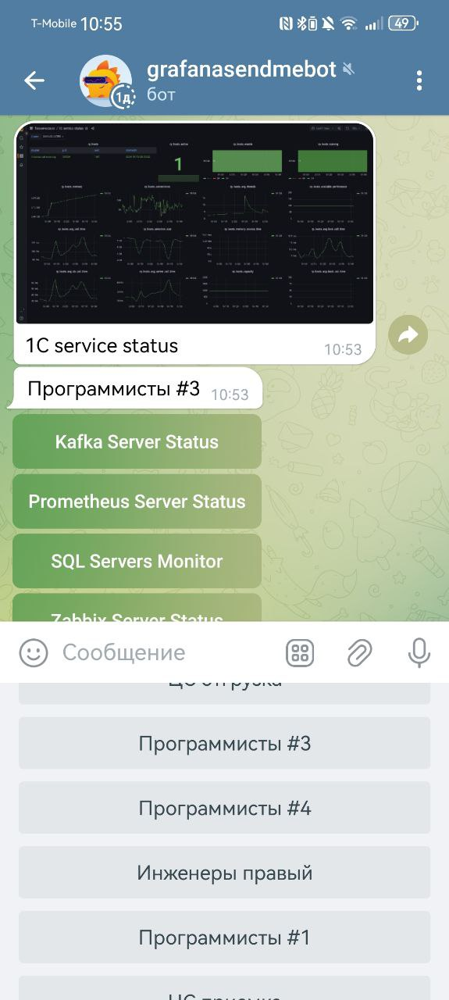

# grafanaBot



## ru 

Телеграмм бот для отправки дашбордов графаны из плейлистов.
Выбираем плейлист, выбираем дашборд из плейлиста, получаем картинку. 

## Использование

Нам понадобятся:
* Токен телеграмм бота
* Идентификаторы Пользователи И/ИЛИ группы которым бот будет отвечать.
* URL графаны 
* Должен быть установлен [Grafana Image Renderer plugin](https://grafana.com/grafana/plugins/grafana-image-renderer/)
  

### Docker

```bash
docker build -t grafanabot -f docker/Dockerfile .

docker run \ 
    -e GRAFANABOT_TELEGRAMM_TOKEN="12365:jahsJHFhvdgjaJGHF" \
    -e GRAFANABOT_TELEGRAMM_USERS="66660503,3883884329" \
    -e GRAFANABOT_TELEGRAMM_GROUPS="-3455345434,-6786786868" \
    -e GRAFANABOT_GRAFANA_URL="http://grafana.local:3000" \
    grafanabot
```

## OneScript

```bash
opm install
cp autumn-properties.json.example autumn-properties.json
code autumn-properties.json #заполняем конфиг
oscript main.os
```

## en

Telegramm bot for sending grafana dashboards from playlistst.

## Usage

```bash

docker run \ 
    -e GRAFANABOT_TELEGRAMM_TOKEN="12365:jahsJHFhvdgjaJGHF" \
    -e GRAFANABOT_TELEGRAMM_USERS="66660503,3883884329" \
    -e GRAFANABOT_TELEGRAMM_GROUPS="-3455345434,-6786786868" \
    -e GRAFANABOT_GRAFANA_URL="http://grafana.local:3000" \
    asosnoviy/grafanabot:latest

```
